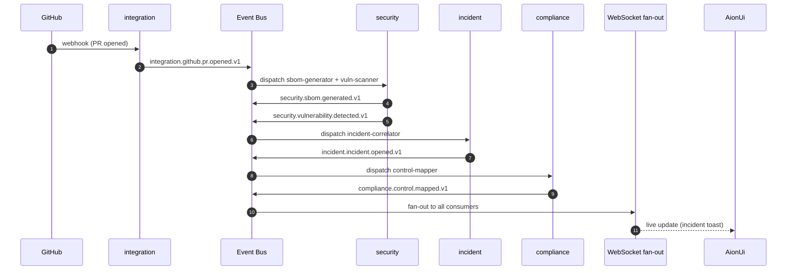

# Event Bus & Agent Communication

> **Status**: Sprint 1 + Sprint 2 update (GitOpsManager).
> **Canonical owner**: PlatformArchitect (subject naming, transport, schemas).
> GitOpsManager owns the **Sprint 2 contract addendum** (S2.4/S2.5
> security topics) below.
>
> See also: [`../adr/0001-event-bus-transport.md`](../adr/0001-event-bus-transport.md),
> [`../adr/0002-agent-to-agent-communication.md`](../adr/0002-agent-to-agent-communication.md),
> [`../adr/0003-event-schema-format.md`](../adr/0003-event-schema-format.md),
> [`../adr/0008-shared-sub-paths.md`](../adr/0008-shared-sub-paths.md) (Sprint 2 — sub-path exports).

## Purpose

Every state-changing event in the Command Center flows over a typed event
bus. This document specifies:

- The bus **technology** (Redis Streams, with a NATS escape hatch)
- The **envelope** and **headers** of every event
- The **subject** naming convention
- The **versioning and compatibility** rules
- The **delivery guarantees** we rely on
- A reference list of **subjects** in the system

## Technology choice

| Driver          | When to use                                                |
| --------------- | ---------------------------------------------------------- |
| `redis-streams` | Default. Single binary, low ops cost, consumer groups.     |
| `nats-jetstream`| Multi-region, higher fan-out, or >100k msg/s.              |

The runtime abstracts this with a small `EventBus` interface; switching
drivers is a config change.

## Envelope

Every event is a JSON object with this exact shape:

```jsonc
{
  // Identifiers
  "id":          "01HXYZ...",                 // ULID; unique per event
  "correlation_id": "01HXYZ...",              // ties related events together
  "causation_id":  "01HXYZ...",               // the event that caused this one

  // Routing
  "subject":     "security.vulnerability.detected.v1",
  "tenant_id":   "tnt_01HXYZ...",
  "source": {
    "service":   "security",
    "agent":     "vuln-scanner",
    "agent_version": "1.4.2",
    "instance":  "security-7d4b-9c"
  },

  // Time
  "occurred_at": "2026-06-12T08:42:11.134Z",   // when the event happened
  "emitted_at":  "2026-06-12T08:42:11.198Z",   // when we put it on the bus

  // Schema
  "schema":      "https://command-center/schemas/security/vulnerability-detected.v1.json",
  "content_type":"application/json",
  "spec_version":"1.0",

  // Security
  "actor": {
    "type":     "user" | "agent" | "service" | "system",
    "id":       "...",
    "ip":       "10.0.0.4",                   // optional
    "user_agent":"aionui/0.1.0"               // optional
  },
  "auth": {
    "scopes":   ["vulnerability:read"],
    "tenant_role": "operator"
  },

  // Data
  "data": { /* event-specific payload, validated against `schema` */ },

  // Metadata
  "trace": {
    "trace_id":  "...",
    "span_id":   "..."
  },
  "labels": {
    "severity":  "high",
    "env":       "production"
  }
}
```

All fields except `data` are reserved and managed by the runtime.
Producer code populates `data` and may add to `labels`.

## Subject naming

Pattern: `<domain>.<aggregate>.<verb>[.v<n>]`

- `domain`     — `security`, `incident`, `compliance`, `integration`, `system`
- `aggregate`  — the noun (`vulnerability`, `incident`, `sbom`)
- `verb`       — past tense (`detected`, `resolved`, `created`)

Examples:

- `security.vulnerability.detected.v1`
- `security.sbom.generated.v1`
- `security.secret.found.v1`
- `incident.incident.opened.v1`
- `incident.incident.classified.v1`
- `compliance.control.mapped.v1`
- `compliance.evidence.attached.v1`
- `integration.pr.comment.posted.v1`
- `system.agent.run.started.v1`
- `system.agent.run.completed.v1`

> The `.v1` is a **schema version**, not a wire version. The wire version
> can evolve additively (new optional fields) without bumping the subject
> version. Breaking changes require a new subject.

## Sprint 2 contract addendum — security topics (S2.4 / S2.5)

The Sprint 2 security stack introduces three typed event subjects,
with their **canonical string constants** exported from
[`@aicc/shared/security`](../../backend/packages/shared/src/security/index.ts):

| Constant        | Subject                              | Producer          | Consumers                                                     |
| --------------- | ------------------------------------ | ----------------- | ------------------------------------------------------------- |
| `SBOM_TOPIC`    | `security.sbom.generated.v1`         | `sbom-pipeline`   | `dependency-intel`, `security-service`, `security-automation` |
| `VULN_TOPIC`    | `security.vulnerability.detected.v1` | `vuln-intel`      | `dependency-intel`, `security-service`, `security-automation` |
| `RISK_TOPIC`    | `security.risk.calculated.v1`        | `dependency-intel`| `security-service`, `security-automation`                     |

> **Hard rule:** service code **must not** hardcode the string
> `"security.sbom.generated.v1"` (or any of the others). It must
> `import { SBOM_TOPIC } from "@aicc/shared/security"`. The
> sub-path export is the single source of truth and is locked in
> ADR 0008. The strings above are documentation mirrors only.

**Type contract** — the constants are accompanied by typed event
interfaces in the same sub-path, validated at producer boundary by a
Zod schema exported from `backend/models/security/`:

```ts
// Consumer (Node.js / Fastify)
import {
  SBOM_TOPIC,
  VULN_TOPIC,
  RISK_TOPIC,
  type SbomGeneratedEvent,
  type VulnerabilityDetectedEvent,
  type RiskCalculatedEvent,
} from "@aicc/shared/security";

// Producer
import { publish } from "@aicc/event-bus";
import { SBOM_TOPIC, type SbomGeneratedEvent } from "@aicc/shared/security";

await publish(SBOM_TOPIC, {
  schema:                "security.sbom.generated.v1",   // discriminator
  sbomId:                "sbom-2026-06-12-a1b2c3d-monorepo",
  sbomFingerprint:       "sha256:9b74c989...d7c8a",      // <alg>:<hex> — SecurityArchitect T-09 audit-log correlation key
  sbomFingerprintAlgorithm: "sha256",                      // O-3.7: hash algorithm (sha256 | sha512 | blake3); prefix in sbomFingerprint MUST match
  sbomFingerprintFormat:    "cyclonedx-json+canonicalized-jcs",  // O-3.7: canonicalization contract; default = JCS canonicalized CycloneDX JSON
  sbomFormat:            "cyclonedx-json",
  sbomPath:              "security/sboms/sbom-2026-06-12-a1b2c3d-monorepo.cyclonedx-json",
  scope:                 "monorepo",
  subject:               "repo:aicc/command-center",
  subjectFingerprint:    "a1b2c3d4e5f6...",             // git SHA / image digest
  generatedAt:           "2026-06-12T18:42:11.420Z",
  generator:             "syft:1.18.0",
  componentsCount:       1842,
} satisfies SbomGeneratedEvent);
```

The `sbomFingerprint` field is required on every `SBOM_TOPIC` event
as of the O-3.6 contract lock (2026-06-12). Producers MUST compute
the digest over the RFC 8785 / JCS canonicalized bytes of the
**primary** format (CycloneDX JSON preferred; SPDX JSON if
CycloneDX is not produced) and emit it as `<alg>:<64-hex>` (or
`<alg>:<128-hex>` for sha512). The field is the audit-log correlation
key for SecurityArchitect's S2.8 § 3.6 mitigations.

The O-3.7 contract lock (2026-06-12) adds the two companion fields
`sbomFingerprintAlgorithm` (hash algorithm: `sha256` | `sha512` |
`blake3`) and `sbomFingerprintFormat` (canonicalization contract:
`cyclonedx-json+canonicalized-jcs` | `cyclonedx-json+raw` |
`spdx-json+canonicalized-jcs` | `spdx-json+raw`). These two fields
are the versioned contract that lets consumers reproduce the exact
input bytes before re-hashing — without them, a "why doesn't my
hash match?" debugging class is unavoidable. The convention aligns
with in-toto / SLSA v1.0 attestation patterns.

The JSON Schema in
[`security/wire-format/sbom-generated.schema.json`](../../security/wire-format/sbom-generated.schema.json)
is the source of truth for the full event contract (13 required
fields as of O-3.7). Snake_case at the wire boundary, camelCase
internally — the fields are published as `sbom_fingerprint`,
`sbom_fingerprint_algorithm`, `sbom_fingerprint_format` in NDJSON
and over the wire, but the TypeScript interface uses
`sbomFingerprint`, `sbomFingerprintAlgorithm`,
`sbomFingerprintFormat`; the event-bus runtime maps between the two.

The full per-model Zod schemas (`SbomSchema`, `VulnerabilitySchema`,
`DependencyGraphSchema`, `RiskScoreSchema`) and their inferred TypeScript
types are re-exported via `@aicc/shared/security/models`. See
[`./security-model.md`](./security-model.md#service-to-service-event-contracts-sprint-2)
for the full producer/consumer/schema-path matrix.

**Versioning policy for these three subjects:**

- Subject version (`.v1`) is bumped **only on a breaking payload change**.
- Adding optional fields is non-breaking; consumers should ignore unknown
  fields (Zod's `.strict()` is OFF by default for these schemas).
- Deprecation of a subject version is announced via a
  `security.<aggregate>.deprecated.v1` event, with at least one minor
  release of overlap.

**GitOps consumer:** `.github/workflows/security.yml` consumes
`vulnerability-detected` (via a small `github-bridge` service that
calls the GitHub `repository_dispatch` API). See
[`../runbooks/security-automation.md`](../runbooks/security-automation.md#system-map)
for the full flow.

## Consumer groups

Each subject has one or more consumer groups, e.g.:

- `notifications` — every event gets a Slack/Jira message
- `audit` — every event is mirrored to the audit store
- `analytics` — every event feeds dashboards

Within a group, each event is delivered to **one** consumer (competing
consumers). Across groups, each event is fanned out to **all** groups.

## Delivery guarantees

- **At-least-once** delivery is the baseline. Consumers must be idempotent.
- Consumers signal success by ACK-ing the message ID.
- Failed messages are retried with exponential backoff (1s, 5s, 30s, 5m, 30m)
  for a configurable number of attempts, then go to a **dead-letter stream**.
- A DLQ is a first-class artifact: it has a UI, an alert, and a
  "replay from DLQ" action.

## Ordering

- Ordering is **per-key** (default: `tenant_id + aggregate_id`).
- We do not promise global ordering. If you need total order, you have a
  design problem.

## Schema management

- Schemas live in `backend/packages/shared/contracts/` as JSON Schema files and
  generated TypeScript types.
- The CI pipeline validates every event in tests against its declared
  schema.
- A breaking schema change requires a new subject version (e.g.
  `security.vulnerability.detected.v2`).

## Example: end-to-end flow



## Observability

### 12.1 Operational SLOs (cross-link)

The SLOs, error budgets, and alert thresholds for the event-bus observability
metrics are owned by SRE and live in
**[`docs/observability/slos-security-stack.md`](../observability/slos-security-stack.md)**.

The platform SLI `devsecops_eventbus_lag_seconds` has these targets:

| Stream | p99 SLO | Rationale |
|---|---:|---|
| `security.events`   | 5 s  | Critical-path security events must propagate fast (incident detection, vuln detection, agent proposals). |
| `compliance.events`  | 30 s | Compliance evaluations are near-real-time but not user-blocking. |
| `audit.events`      | 60 s | Audit is asynchronous; consumers tolerate higher lag (audit log has its own durability story in Postgres + S3). |
| **Aggregate**        | 5 s  | Fleet-wide target; computed as `histogram_quantile(0.99, sum(rate(devsecops_eventbus_lag_seconds_bucket[5m])) by (le))`. |

**Why three per-stream targets and one aggregate:** the aggregate is the
platform-level commitment; the per-stream targets acknowledge that
`audit.events` legitimately tolerates higher lag (we should not be
paged at 3am because audit is a few minutes behind — that's a
different operational concern).

**Histogram bucket shape for lag:** the metric uses SLO-shaped buckets
`(0.05, 0.1, 0.25, 0.5, 1, 2.5, 5, 10, 30, 60, 300)` so that
`histogram_quantile(0.99, …)` has good resolution at the 5s SLO
threshold. Always `sum by (le, …)` before `histogram_quantile()` —
a p99 computed on a single-pod series is wrong for the fleet.

**Related metrics:**
- `devsecops_sbom_generation_duration_seconds` — see `metrics-spec.md` §3.1
- `devsecops_risk_calculation_duration_seconds` — see `metrics-spec.md` §3.3
- `devsecops_vulnerability_ingestion_lag_seconds` — see `metrics-spec.md` §3.7

**Future work (Sprint 3+):**
- Multi-window burn-rate alerts (Google SRE workbook style) — currently the platform uses threshold alerts. See SLO doc F1 follow-up.
- Per-tenant SLI rollup job (without exploding cardinality) — open design question.

## See also

- [`agent-topology.md`](./agent-topology.md) — who produces what
- [`system-architecture.md`](./system-architecture.md) — where the bus lives
- [`../adr/0001-event-bus-transport.md`](../adr/0001-event-bus-transport.md) — transport choice
- [`../adr/0003-event-schema-format.md`](../adr/0003-event-schema-format.md) — schema format
- [`/backend/packages/shared/contracts/`](../../backend/packages/shared/contracts/) — schemas
- [`/backend/packages/shared/events/`](../../backend/packages/shared/events/) — runtime client
